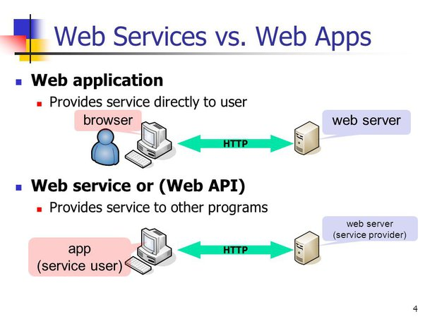

# Web Services

## Principes

* Accéder à une **ressource** sur un serveur depuis une **application** (client) via une requête HTTP 
* Recevoir une réponse au format JSON (ou anciennement XML)

### Différence entre Web App et Web Services

### REST API

* REST = representational state transfer
* API = application programming interface

* Client = User Agent
* Protocol = HTTP
* Method = GET / POST / PUT / DELETE
* URI / Endpoint
* Payload

## Exercices

En utilisant la DB mediarnaque.sql fournie

Créez une API permettant de : 

### Récupérer les données d'un utilisateur
* Le endpoint sera : /user/{id}
* La méthode sera GET
* Un token sera nécessaire pour accéder à la ressource
* La valeur de retour sera un objet JSON

### Récupérer la liste des utilisateurs
* Le endpoint sera : /users/
* La méthode sera GET
* Un token sera nécessaire pour accéder à la ressource
* La valeur de retour sera un tableau d'objets JSON

### Créer un utilisateur
* Le endpoint sera : /user/
* La méthode sera POST
* Un token sera nécessaire pour accéder à la ressource
* La valeur de retour sera un objet JSON avec les données de l'utilisateur créé

### Mettre à jour un utilisateur
* Le endpoint sera : /user/{id}
* La méthode sera PUT
* Le payload contiendra l'objet utilisateur mis à jour
* Un token sera nécessaire pour accéder à la ressource
* La valeur de retour sera un objet JSON avec les données de l'utilisateur mis à jour

### Supprimer un utilisateur
* Le endpoint sera : /user/{id}
* La méthode sera DELETE
* Un token sera nécessaire pour accéder à la ressource
* La valeur de retour sera "success" en cas de succès ou "failed" en cas d'échec
